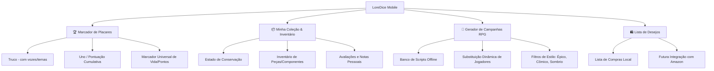
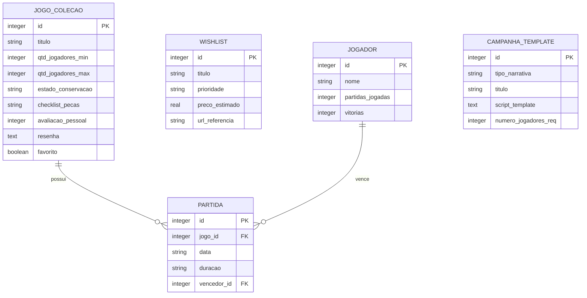

# 🎲 LoreDice: O Companheiro Definitivo de Jogos de Tabuleiro, Cartas e RPG

**LoreDice** é um aplicativo mobile focado em centralizar tudo o que um entusiasta de jogos analógicos (tabuleiro, cartas e RPG) precisa no seu dia a dia, com funcionamento **100% offline** (offline-first). O app resolve dores comuns de jogadores, como marcar pontuações complexas, gerenciar o estado físico de coleções, planejar desejos e gerar campanhas completas de RPG de mesa instantaneamente sem depender de conexão com a internet.

---

## 🚀 Visão Geral das Funcionalidades

O LoreDice é dividido em 4 grandes pilares fundamentais, todos integrados em uma interface elegante, moderna e fluida.



### 1. 🏆 Marcador de Placares (Scoreboards)

- **Presets Dedicados:** Marcadores específicos estruturados para regras de jogos populares:
  - **Truco:** Marcador clássico de 12 pontos com botão rápido de "Truco!" (podendo incluir efeitos sonoros engraçados).
  - **Uno / Jogos de Cartas:** Painel com cálculo cumulativo de pontos ao final de cada rodada.
  - **Jogos de Tabuleiro Euro/Estratégia:** Tabela de pontuação de fim de jogo dividida por categorias (ex: pontos de recursos, cartas de objetivo, moedas).
- **Marcador Universal:** Um contador modular onde o usuário pode adicionar quantos jogadores quiser, definir limite de pontuação, incrementar/decrementar facilmente e gerenciar o tempo com cronômetro integrado.
- **Histórico Local:** Registro de partidas jogadas com data, jogadores e quem foi o grande vencedor da noite.

### 2. 📦 Minha Coleção & Inventário

- **Ficha Técnica do Jogo:** Registro detalhado com título, editora, quantidade recomendada de jogadores e tempo médio.
- **Estado de Conservação:** Escala visual do estado físico da caixa e dos componentes (ex: Novo, Desgastado, Faltando Peças).
- **Controle de Componentes:** Lista de peças críticas (ex: "Contém 120 cartas de recursos, 32 meeples de madeira") para que o usuário possa fazer um check-up rápido após uma sessão e garantir que nada se perdeu.
- **Avaliação Pessoal:** Sistema de estrelas (1 a 5), resenha pessoal ("o que eu achei do jogo"), e tags rápidas (ex: "Complexo", "Party Game", "Familiar", "Queridinho").

### 3. 🔮 Gerador de Campanhas RPG (offline)

Este é o coração narrativo do app. O LoreDice carrega um robusto **mecanismo interno de templates textuais narrativos** para que mestres e jogadores tenham ideias ou campanhas prontas instantaneamente.

- **Mecanismo de Substituição Dinâmica (Scripting Engine):** O app possui dezenas de scripts estruturados com placeholders como `{JOGADOR_1}`, `{JOGADOR_2}`, `{VILÃO}`, `{RELÍQUIA}`, `{CIDADE}`.
- **Preenchimento Personalizado:** O usuário insere o nome dos seus amigos e define as preferências da campanha.
- **Filtros Narrativos:**
  - ⚔️ **Aventura Épica/Padrão:** Foco em fantasia medieval clássica, calabouços e glória.
  - 🎭 **Espalhafatosa/Cômica:** Narrativas divertidas, com situações bizarras e NPCs inusitados.
  - 🕷️ **Sombria/Terror:** Clima tempo, mistérios lovecraftianos ou sobrevivência.
- **Banco Local Extensível:** Milhares de roteiros e ganchos de aventura pré-carregados no banco de dados local. Toda atualização do app via app store traz novos pacotes de campanhas (DLCs gratuitas).

### 4. 🛍️ Lista de Desejos (Wishlist) & E-Commerce

- **Wishlist Local:** Área dedicada para adicionar jogos que o usuário planeja comprar, com prioridade (Alta, Média, Baixa) e preço médio estimado.
- **Integração Futura (Amazon & Afiliados):**
  - Pesquisa e sincronização rápida de preços.
  - Link direto com tag de afiliado para compra na Amazon, gerando monetização para o projeto de forma orgânica.

---

## 🛠️ Stack Tecnológica Recomendada

Para um aplicativo focado em ser **offline**, **extremamente performático** e **multiplataforma** (Android e iOS), a stack ideal recomendada é:

### 📱 Front-End Mobile: **React Native com Expo (TypeScript)**

- **Por que Expo?**
  - Ciclo de desenvolvimento absurdamente rápido.
  - Facilidade para testar no próprio celular (Expo Go).
  - Suporte nativo e robusto para banco de dados local SQLite.
  - Facilidade extrema para lidar com fontes personalizadas, sons (para o Truco) e animações micro-interativas.
  - Expo EAS para buildar e publicar nas lojas de forma muito simplificada.

### 💾 Banco de Dados Local: **Drizzle ORM + Expo SQLite**

- **Por que essa combinação é a melhor escolha aqui?**
  - **Drizzle ORM (Type-Safe & Ultra-leve):** Diferente de ORMs pesados como o Prisma (que aumentam o bundle do app com motores Rust), o Drizzle é extremamente leve, rápido e oferece tipagem TypeScript completa em tempo de desenvolvimento.
  - **Zero Custos de Nuvem:** A base SQLite roda inteiramente no dispositivo do usuário, garantindo privacidade de dados e custo zero de servidores.
  - **Performance Offline Máxima:** Consultas complexas em milissegundos, sem latência de rede.
  - **Relacionamento de Dados Avançado:** Perfeito para fazer joins complexos entre `Jogadores`, `Partidas` e `Coleções` de forma nativa e rápida.
  - **Migrações Automatizadas:** Novos scripts de campanhas de RPG podem ser entregues como migrações automáticas do Drizzle (`drizzle-kit`) em updates regulares na App Store/Google Play, aplicando atualizações no banco do usuário silenciosamente na inicialização.

---

## 🏗️ Arquitetura & Engenharia

Esta seção consolida as decisões técnicas que garantem que o LoreDice seja sustentável, testável e acessível desde a primeira linha de código.

### 📁 Estrutura de Diretórios

```
loredice/
├── app/                          # Expo Router (file-based routing)
│   ├── (tabs)/                   # Abas principais da navegação
│   │   ├── scoreboards/          #   Placares (Truco, Universal, Uno)
│   │   ├── collection/           #   Minha Coleção
│   │   ├── rpg/                  #   Gerador de Campanhas
│   │   └── wishlist/             #   Lista de Desejos
│   ├── game/                     # Rotas de detalhe / edição de jogo
│   ├── match/                    # Histórico e detalhes de partidas
│   └── settings/                 # Configurações e About
├── src/
│   ├── components/               # Componentes reutilizáveis
│   │   ├── ui/                   #   Botões, inputs, cartas, badges
│   │   └── scoreboard/           #   Componentes específicos de placar
│   ├── db/
│   │   ├── schema/               #   Schema Drizzle (tabelas, relações)
│   │   ├── migrations/           #   Migrations geradas pelo drizzle-kit
│   │   └── seed/                 #   Seeds para templates RPG iniciais
│   ├── services/                 # Lógica de negócio (placar, campanha)
│   ├── stores/                   # Estado global (Zustand)
│   ├── hooks/                    # Custom hooks reutilizáveis
│   ├── utils/                    # Funções utilitárias puras
│   ├── lib/                      # Config de bibliotecas (Drizzle, DB)
│   ├── errors/                   # Error boundaries, códigos de erro
│   └── i18n/                     # Internacionalização (pt-BR, en)
├── __tests__/                    # Testes unitários e de integração
├── e2e/                          # Testes E2E (Maestro)
├── assets/                       # Fontes, sons, imagens estáticas
├── app.json                      # Expo config
└── drizzle.config.ts             # Config do Drizzle Kit
```

**Por que Expo Router (file-based routing)?**

- Navegação declarativa baseada em arquivos — cada pasta vira uma rota automaticamente
- Agrupamento de rotas com `(tabs)`, `(modals)` sem poluir a árvore real
- Deep linking gratuito e consistente entre Android e iOS
- Melhor integração com o ecossistema Expo

### 🧭 Navegação

O LoreDice usa uma estrutura de navegação em dois níveis:

| Nível | Tipo                      | Conteúdo                                 |
| ----- | ------------------------- | ---------------------------------------- |
| 1º    | Bottom Tab Navigator      | 4 abas: Placares, Coleção, RPG, Wishlist |
| 2º    | Stack Navigator (por aba) | Telas de detalhe, edição, histórico      |

**Bottom Tabs:**

```
🏆 Placares        → Lista de modos (Truco, Universal, Uno)
📦 Coleção         → Grid/Lista de jogos → Detalhe do jogo
🔮 RPG             → Gerador de campanha → Resultado
🛍️ Wishlist       → Lista de desejos → Detalhe
```

**Stack por aba** — cada aba tem seu próprio stack:

- **Placares:** `ScoreboardList → GameScoreboard → MatchHistory → MatchDetail`
- **Coleção:** `CollectionGrid → GameDetail → EditGame → ComponentChecklist`
- **RPG:** `CampaignForm → CampaignResult → CampaignDetail`
- **Wishlist:** `WishlistList → WishlistDetail → AddItem`
- **Settings:** Modal acessível de qualquer tela via ícone de engrenagem no header

**Deep Linking (futuro):**

```
loredice://scoreboard/truco
loredice://collection/42
loredice://campaign/15
```

### ⚡ Gerenciamento de Estado

O LoreDice adota uma estratégia de estado em **três camadas**, cada uma resolvendo um problema específico:

| Camada                 | Tecnologia                | O que gerencia                                           | Por quê                                                            |
| ---------------------- | ------------------------- | -------------------------------------------------------- | ------------------------------------------------------------------ |
| **UI Local**           | `useState` / `useReducer` | Inputs de formulário, animações, toggle de modais        | Zero dependência, escopo local, descartável                        |
| **Estado Global**      | **Zustand**               | Timer ativo, jogo selecionado, placar em andamento, tema | Leve (~1KB), sem boilerplate, tipado, funciona fora de componentes |
| **Estado Persistente** | **Drizzle ORM + SQLite**  | Jogos, partidas, templates, wishlist                     | Fonte da verdade offline, consultas complexas com join             |

**Por que Zustand em vez de Context ou Redux?**

| Critério                     | Zustand                      | Context API                        | Redux Toolkit      |
| ---------------------------- | ---------------------------- | ---------------------------------- | ------------------ |
| Bundle                       | ~1KB                         | 0 (nativo)                         | ~12KB              |
| Boilerplate                  | Nenhum                       | Médio                              | Alto               |
| Performance                  | Seletiva (sem re-render全局) | Re-renderiza todos os consumidores | Seletiva           |
| Funciona fora de componentes | Sim                          | Não                                | Sim (thunks/sagas) |
| Persistência                 | Plugin `zustand/middleware`  | Manual                             | Manual             |

**Conclusão:** Zustand entrega o melhor custo-benefício para um app offline-first com estado global moderado. Redux é excesso de engenharia para este escopo.

### 🔄 Fluxo de Dados (Arquitetura)

```
[UI Component]
     ↓  ação do usuário (botão, input)
[Hook personalizado (useScoreboard, useGameDetail)]
     ↓  orquestra lógica
[Service (ScoreboardService, CampaignService)]
     ↓  regras de negócio, cálculos, validação
[Store Zustand] ← → [Drizzle ORM] → [SQLite]
     ↓                     ↑
[UI Re-render]     [Migração Drizzle-kit]
```

**Princípios:**

1. **Components são burros** — não contêm regra de negócio, só chamam hooks e renderizam
2. **Hooks orquestram** — conectam UI aos services e stores, gerenciam生命周期
3. **Services são puros** — funções que recebem dados e retornam dados, testáveis isoladamente
4. **Stores são thin** — só mantêm estado transitório (não persistem), o SQLite é a fonte da verdade
5. **Database é a única fonte da verdade** — ao abrir o app, tudo vem do SQLite; estado volátil (timer, animação) fica em memória

### 🛠️ Tooling & Code Quality

| Ferramenta                   | Função                                    | Configuração                                                              |
| ---------------------------- | ----------------------------------------- | ------------------------------------------------------------------------- |
| **TypeScript** strict mode   | Tipagem rigorosa em todo o projeto        | `tsconfig.json` com `strict: true`, `noUncheckedIndexedAccess`            |
| **ESLint**                   | Linting estático                          | `eslint.config.js` com regras para React Native, TypeScript, import order |
| **Prettier**                 | Formatação automática                     | `.prettierrc` — sem conflito com ESLint via `eslint-config-prettier`      |
| **Husky** + **lint-staged**  | Pré-commit: lint + formata automática     | `husky pre-commit` → `lint-staged` → `tsc --noEmit`                       |
| **Expo EAS**                 | Build + Submit nas lojas                  | `eas.json` com profiles dev, preview, production                          |
| **GitHub Actions**           | CI/CD                                     | PR: lint + typecheck + tests / Merge na main: EAS build                   |
| **drizzle-kit**              | Migrações automáticas                     | `drizzle.config.ts` → `drizzle-kit push:sqlite` (dev) / `generate` (prod) |
| **Dotenv** / `app.config.ts` | Variáveis de ambiente (AdMob, RevenueCat) | Validadas em build time, nunca expostas                                   |

**Workflow do desenvolvedor:**

```bash
npm run dev          # Expo dev server + SQLite local
npm run lint         # ESLint em todo o projeto
npm run typecheck    # tsc --noEmit
npm run test         # Jest em watch mode
npm run db:push      # Drizzle push (dev) — sincroniza schema com SQLite
npm run db:generate  # Gera migration para produção
```

### 🧪 Estratégia de Testes

O LoreDice adota a **pirâmide de testes** clássica adaptada para React Native:

```
         ╱╲
        ╱ E2E ╲           ← Maestro: fluxos críticos (3-5 testes)
       ╱────────╲
      ╱ Integração ╲       ← RNTL: componentes + hooks (20-30 testes)
     ╱──────────────╲
    ╱   Unitários     ╲    ← Jest: services + utils (80%+ cobertura)
   ╱────────────────────╲
```

#### Camada 1 — Testes Unitários (Jest)

**O que testar:**

- `services/` — regras de negócio puras (cálculo de pontos Truco, substituição de placeholders RPG)
- `utils/` — funções auxiliares (formatação de data, validação de input)
- `stores/` — lógica de estado global (sem UI)

**Ferramentas:** Jest + `@jest/globals`

**Exemplo de service testável:**

```typescript
// services/scoreboard.ts — função pura, sem dependência externa
function calcularPontuacaoTruco(vitorias: number, trucamentos: number): number;
function aplicarPlaceholders(template: string, jogadores: string[]): string;
```

**Regra:** toda função em `services/` DEVE ser testada. Se não consegue testar isoladamente, a arquitetura está errada.

#### Camada 2 — Testes de Integração (React Native Testing Library)

**O que testar:**

- Componentes compostos (`ScoreboardPanel`, `GameCard`, `PlayerList`)
- Hooks customizados com comportamento assíncrono
- Fluxos de navegação entre telas

**Ferramentas:** RNTL (`@testing-library/react-native`)

**O que NÃO testar:**

- Estilos CSS (isso é responsabilidade do review visual)
- Bibliotecas de terceiros (Drizzle, Zustand)
- Animações

**Exemplo:**

```typescript
// Testa se o placar de Truco incrementa ao clicar no botão
render(<TrucoScoreboard />);
fireEvent.press(screen.getByTestId('add-points-team-a'));
expect(screen.getByText('1')).toBeTruthy();
```

#### Camada 3 — Testes E2E (Maestro)

**O que testar:**

- Fluxo crítico: abrir app → selecionar Truco → marcar pontos → finalizar → ver histórico
- Fluxo de coleção: adicionar jogo → editar → salvar → ver na lista
- Fluxo de campanha: preencher jogadores → gerar → ver resultado

**Ferramenta recomendada: Maestro**

- Gratuito, open-source
- Sintaxe YAML declarativa
- Roda local e em CI
- Suporte nativo a React Native (detecta elementos por `testID`)

**Exemplo de flow (`.maestro/scoreboard.yaml`):**

```yaml
appId: com.axellion.loredice
---
- tapOn: 'Truco'
- tapOn: 'Adicionar Ponto Time A'
- assertVisible: '1'
- tapOn: 'Finalizar Partida'
- assertVisible: 'Partida Salva!'
```

#### Cobertura Mínima na V1

| Camada     | Meta                  | Ferramenta          |
| ---------- | --------------------- | ------------------- |
| Unitários  | > 80% statements      | Jest + nyc/istanbul |
| Integração | > 60% linhas críticas | RNTL                |
| E2E        | 3 fluxos felizes      | Maestro             |

#### Comandos

```bash
npm run test              # Jest em modo watch
npm run test:ci           # Jest em modo CI (coverage report)
npm run test:e2e          # Maestro (requer app buildado)
npm run test:all          # Rodar todas as camadas
```

### ⚠️ Tratamento de Erros

O LoreDice adota uma estratégia de **tratamento de erros em 4 camadas**, garantindo que o usuário nunca veja uma tela branca ou um crash silencioso.

#### 1. Error Boundaries (React)

Cada aba principal tem seu próprio Error Boundary:

```
App
├── Tab1 (Placares) → ErrorBoundaryPlacares
├── Tab2 (Coleção)  → ErrorBoundaryColecao
├── Tab3 (RPG)      → ErrorBoundaryRPG
└── Tab4 (Wishlist) → ErrorBoundaryWishlist
```

**Comportamento:**

- Erro não fatal → exibe componente de fallback com mensagem amigável + botão "Tentar Novamente"
- Erro fatal → exibe tela de erro genérica com sugestão de reiniciar o app
- Em dev: expõe stack trace; em produção: oculta detalhes técnicos

**Exemplo de fallback:**

```
 ┌─────────────────────┐
 │  ⚠️ Algo deu errado  │
 │                     │
 │  Não foi possível   │
 │  carregar seus      │
 │  placares.          │
 │                     │
 │  [ Tentar Novamente ]│
 │                     │
 │  Se o problema      │
 │  persistir,         │
 │  reinicie o app.    │
 └─────────────────────┘
```

#### 2. Database Errors (Drizzle + SQLite)

**Cenários e estratégias:**

| Cenário             | Causa                   | Estratégia                                                                      |
| ------------------- | ----------------------- | ------------------------------------------------------------------------------- |
| `SQLITE_BUSY`       | Concorrência de escrita | Retry com backoff exponencial (3 tentativas, 100ms/200ms/400ms)                 |
| `SQLITE_CORRUPT`    | Banco corrompido        | Abrir tela de erro com opção de resetar banco local / restaurar de backup       |
| `UNIQUE_CONSTRAINT` | Duplicidade de dados    | Capturar no service, exibir toast amigável ("Este jogo já está na sua coleção") |
| Migration failed    | Atualização incompleta  | Bloquear inicialização, exibir "Atualização necessária" com instruções          |

**Implementação:**

```typescript
// lib/db.ts — wrapper de acesso ao banco
async function executeQuery<T>(query: () => Promise<T>, context: string): Promise<T> {
  try {
    return await query();
  } catch (error) {
    if (error instanceof SqliteError) {
      return handleDatabaseError(error, context);
    }
    throw error; // Erro não mapeado → sobe para Error Boundary
  }
}
```

**Regra:** NENHUM erro de banco chega cru ao usuário. Todo erro SQLite é interceptado, classificado e convertido em mensagem legível.

#### 3. Service Layer Errors

Os `services/` usam um padrão **Result Type** (Either monad simplificado) para erros previsíveis:

```typescript
// utils/result.ts
type Result<T, E = AppError> = { success: true; data: T } | { success: false; error: E };

// services/campaign-generator.ts
function generateCampaign(params: CampaignParams): Result<Campaign, CampaignError> {
  if (params.players.length < params.requiredPlayers) {
    return {
      success: false,
      error: { code: 'INSUFFICIENT_PLAYERS', message: 'Mínimo de 2 jogadores necessário' },
    };
  }
  // ... lógica ...
  return { success: true, data: campaign };
}
```

**Vantagens:**

- Força o caller a tratar o erro (TypeScript não deixa ignorar)
- Erro é um valor, não uma exceção — previsível e rastreável
- UI pode mapear `error.code` para mensagens localizadas

#### 4. UI/UX Error Handling

| Tipo                | Como exibir                        | Quando usar                                                                         |
| ------------------- | ---------------------------------- | ----------------------------------------------------------------------------------- |
| **Toast**           | Toast animado no topo (duração 3s) | Operações não críticas: "Jogo salvo!", "Erro ao salvar. Tente novamente."           |
| **Inline**          | Mensagem abaixo do campo           | Erros de formulário: "Nome do jogo é obrigatório"                                   |
| **Modal**           | Modal central com ação             | Erros que exigem decisão: "Banco de dados corrompido. Deseja resetar ou restaurar?" |
| **Fallback Screen** | Tela inteira de erro               | Error Boundary: algo quebrou e não há recovery                                      |
| **Offline Banner**  | Banner persistente no topo         | App detectou falta de conectividade (para futuras features online)                  |

**Hierarquia de exibição:**

```
Toast (info/sucesso)
  ↓
Inline (erro de campo)
  ↓
Modal (erro recuperável)
  ↓
Fallback Screen (erro não recuperável)
```

#### 5. Logging e Diagnóstico

```typescript
// services/logger.ts — log local para debug
function logError(context: string, error: Error, metadata?: Record<string, unknown>): void {
  // Escreve em tabela SQLite `error_logs`:
  //   id, timestamp, context, error_message, stack_trace, metadata_json
  // Em produção: NUNCA expõe ao usuário, mas armazena para diagnóstico
  // Em dev: console.error padrão
}
```

**Política de retenção:** logs de erro com mais de 30 dias são limpos automaticamente na inicialização.

#### 6. O que NÃO tratar como erro

- **App offline:** não é erro, é o estado natural do LoreDice. O app foi projetado para funcionar 100% offline.
- **Usuário cancela operação:** não é erro, é fluxo normal.
- **Anúncio não carregou:** não exibir nada, apenas ocultar a view de anúncio.

### ♿ Acessibilidade

Acessibilidade no LoreDice não é um extra — é um requisito de engenharia desde a V1. O app deve ser utilizável por jogadores com deficiência visual, motora ou auditiva.

#### 1. Suporte a Leitores de Tela (Screen Readers)

**Android (TalkBack) / iOS (VoiceOver):**

```typescript
// Todo elemento interativo DEVE ter:
<Pressable
  accessibilityLabel="Adicionar ponto para o Time A"
  accessibilityRole="button"
  accessibilityState={{ disabled: gameOver }}
  onPress={addPoint}
>
```

**Boas práticas no LoreDice:**

- `accessibilityLabel` em português, descritivo e contextual
- `accessibilityRole` correto: `button`, `adjustable` (sliders), `header`, `image`
- `accessibilityLiveRegion` para atualizações dinâmicas de placar:
  ```typescript
  <Text accessibilityLiveRegion="polite">
    Placar: Time A {scoreA}, Time B {scoreB}
  </Text>
  ```
- Agrupar elementos relacionados com `accessibilityGroup`
- Evitar `accessibilityElementsHidden` em elementos visuais decorativos

#### 2. Navegação por Teclado (Android + teclado Bluetooth)

- Todos os `Pressable` e `TouchableOpacity` são focáveis por padrão
- Ordem de foco lógica (da esquerda para direita, de cima para baixo)
- `accessible: true` em containers que agregam múltiplos elementos

#### 3. Contraste de Cores

| Critério             | WCAG AA (mínimo) | WCAG AAA (recomendado) |
| -------------------- | ---------------- | ---------------------- |
| Texto normal         | 4.5:1            | 7:1                    |
| Texto grande (>18px) | 3:1              | 4.5:1                  |
| Componentes UI       | 3:1              | 4.5:1                  |

**Paleta LoreDice validada:**

- Fundo `#12101F` sobre texto branco `#FFFFFF`: contraste **14.5:1** ✅ AAA
- Roxo neon `#9D4EDD` sobre fundo `#12101F`: contraste **5.2:1** ✅ AA
- Ouro `#FFB703` sobre fundo `#12101F`: contraste **10.1:1** ✅ AAA

#### 4. Fontes Dinâmicas (Dynamic Type)

- Usar unidades relativas (`rem`, não `px`) para tamanhos de fonte
- Suporte a scaling do sistema:
  ```typescript
  import { PixelRatio } from 'react-native';
  const fontScale = PixelRatio.getFontScale(); // respeita ajuste do usuário
  ```
- Testar com fontes 200% maiores sem quebra de layout
- Evitar truncamento de texto (`numberOfLines`) em elementos críticos (placar, nome de jogador)

#### 5. Redução de Movimento

- Respeitar `AccessibilityInfo.isReduceMotionEnabled()`:
  ```typescript
  const [reduceMotion, setReduceMotion] = useState(false);
  useEffect(() => {
    AccessibilityInfo.addEventListener('reduceMotionChanged', setReduceMotion);
  }, []);
  ```
- Se reduzido: desligar animações de virar carta, slides, partículas
- Manter apenas transições de fade (menos agressivas)

#### 6. Feedback Multissensorial

| Ação              | Visual                   | Sonoro       | Tátil (vibração) |
| ----------------- | ------------------------ | ------------ | ---------------- |
| Marcar ponto      | Número incrementa + glow | Tick suave   | Vibração curta   |
| Truco!            | Animação de carta        | Som de truco | Vibração média   |
| Erro              | Toast vermelho           | Som de erro  | Vibração longa   |
| Finalizar partida | Confete                  | Fanfarra     | Vibração curta   |

**Regra:** NENHUM feedback essencial é exclusivamente visual ou sonoro. Toda informação crítica tem pelo menos 2 canais de saída.

#### 7. Testes de Acessibilidade

```bash
npm run test:a11y          # Jest + axe-core (RNTL): verifica roles, labels, contraste
npm run e2e:talkback       # E2E com TalkBack ativo (Android)
```

**O que verificar em toda PR:**

1. Todo `Pressable` tem `accessibilityLabel` único e descritivo
2. Leitores de tela conseguem navegar por todos os fluxos principais
3. Contraste mínimo 4.5:1 em todos os elementos textuais
4. App não trava/fica responsivo com fontes 200%

---

## 📐 Estrutura de Banco de Dados Sugerida (Modelo Físico Relacional)

Abaixo, a modelagem ideal para estruturar a base de dados SQLite local no aparelho:



---

## ✨ Proposta de Design e Experiência do Usuário (UX/UI)

Para criar um app premium e atraente para o público gamer e geek:

1. **Paleta de Cores Geek/Modern:**
   - Fundo: Roxo Escuro/Grafite Profundo (`#12101F` ou `#1A1829`) para uma estética noturna confortável para jogar na mesa à noite.
   - Destaques (Acents): Roxo Neon (`#9D4EDD`) e Ouro/Amarelo RPG (`#FFB703`) para botões importantes, rolagens de dados e vitórias.
2. **Tipografia Premium:**
   - Títulos com fontes com toque aventureiro ou corporativo geek (ex: _Outfit_ ou _Cinzel_ para RPG, _Inter_ para tabelas de pontos).
3. **Micro-interações:**
   - Feedback tátil (vibração do celular) ao marcar pontos ou quando alguém atinge o limite do placar.
   - Transições suaves em formato de cartas deslizando ao navegar pelos menus.

---

## 💰 Modelo de Monetização (Anúncios & Premium)

O LoreDice adota um modelo híbrido e inteligente de monetização (**Freemium**), otimizado para não prejudicar a experiência do jogador e funcionar perfeitamente de forma **offline**:

1. **Anúncios Inteligentes (Google AdMob):**
   - **Banners Discretos:** Exibidos na parte inferior de telas como os placares de jogos.
   - **Intersticiais (Transição):** Vídeos ou imagens rápidas exibidos em momentos de transição natural (ex: ao finalizar uma partida ou gerar uma nova campanha de RPG).
   - **Anúncios Premiados (Rewarded Ads):** Os usuários podem escolher assistir a um anúncio de 15 segundos para desbloquear recursos temporários (ex: liberar templates extras de campanhas espalhafatosas ou cômicas).
   - _Funcionamento Offline:_ O SDK do Google AdMob baixa anúncios em cache em momentos em que o celular está conectado, garantindo que o app continue monetizando mesmo offline. Se não houver cache nem internet, nenhum anúncio falho/quebrado é exibido.

2. **In-App Purchase (Compra Única de R$ 5,00 a R$ 10,00):**
   - Opção na tela de configurações para **"Remover Anúncios"** permanentemente.
   - Ao efetuar a compra única (gerenciada nativamente pelo Google Play / App Store ou simplificada via **RevenueCat**):
     - O status do usuário é atualizado localmente no SQLite (`usuario_premium = 1`).
     - Todos os banners e anúncios intersticiais são permanentemente removidos e ocultados da interface.
     - O status de compra é mantido em cache offline seguro no dispositivo do jogador.

---

## 🍏 Estratégia de Custos e Distribuição (Android vs iOS)

O lançamento em lojas oficiais possui custos distintos (taxa única de $25 no Android vs taxa anual de $99 no iOS). Para mitigar custos iniciais de desenvolvimento e publicação, a seguinte estratégia de distribuição é adotada:

1. **Desenvolvimento e Testes (Grátis em Ambos):**
   - Utilização do **Expo Go** no iOS e Android para compartilhar o app em tempo real com amigos, familiares e testadores locais via link ou QR Code, sem precisar de nenhuma conta paga de desenvolvedor.
2. **Lançamento Inicial de Validação (Android):**
   - Publicação oficial na Google Play Store (taxa única de $25). Foco em validar a ideia do app, angariar a base inicial de usuários e gerar receita inicial com anúncios e compras integradas.
3. **Alternativa Totalmente Gratuita (PWA - Progressive Web App):**
   - Possibilidade de exportar a interface em React Native para a Web (React Native Web) e hospedá-la gratuitamente (Netlify/Vercel). Os usuários de iOS podem adicionar o site à tela de início do iPhone, executando o app em tela cheia com banco de dados local offline (IndexedDB/WebSQL), contornando as taxas da App Store a custo zero.
4. **Lançamento Oficial iOS (Futuro):**
   - Assim que a receita acumulada no Android/PWA cobrir o custo ou o app se consolidar no mercado, faz-se o investimento na conta de desenvolvedor anual da Apple ($99) para publicação direta na App Store oficial.

### 📣 Estratégia de Crescimento Orgânico (Como atingir 5.000+ usuários de graça)

O nicho de jogos analógicos (board games e RPG) possui características únicas que tornam a aquisição de usuários orgânica extremamente viável e rápida através de duas frentes principais:

1. **O "Fator Mesa de Jogo" (Boca a Boca Multiplicador):**
   - O LoreDice é intrinsecamente **social**. Ao ser usado fisicamente na mesa (marcando pontos no Truco/Uno ou gerando campanhas de RPG), pelo menos mais 3 a 5 jogadores visualizam a interface moderna, ouvem os efeitos sonoros e sentem o feedback tátil.
   - Cada usuário ativo funciona como um "outdoor interativo", demonstrando o app de graça para novos potenciais usuários a cada rodada de jogo.

2. **Divulgação Direta em Comunidades Ultra-Engajadas:**
   - **Comunidades de Nicho:** Divulgação direta e transparente no Reddit (ex: `r/rpg_brasil`, `r/boardgames`), servidores de Discord focados em RPG/sistemas e grupos ativos do Facebook/Telegram. Gamers adoram apoiar projetos independentes!
   - **Playtesting Público:** Lançamento de versões Beta nessas redes pedindo feedbacks sinceros de melhorias de roteiros ou usabilidade de placares. Isso atrai os primeiros 500 a 1.000 usuários ávidos logo no início.
   - **Parcerias com Micro-influenciadores:** Envio de chaves gratuitas da "Versão Premium sem Anúncios" para criadores menores de conteúdo sobre jogos analógicos em troca de demonstrações espontâneas em vídeos curtos (Reels/TikTok/Shorts).

3. **ASO (App Store Optimization - SEO de Aplicativos):**
   - Otimização do título e palavras-chave na loja para termos altamente buscados com concorrência visualmente defasada, tais como: _"Marcador de Truco"_, _"Contador de vida RPG"_, _"Gerador de Aventuras RPG"_ e _"Organizador de Board Games"_.

---

## 📈 Próximos Passos de Desenvolvimento

1. **Fase 1: Protótipo de Placares e Coleção (Local Store)**
   - Criar a base do app com Expo + SQLite.
   - Desenvolver os placares clássicos (Truco/Contador Universal) e a tela de inventário de jogos.
2. **Fase 2: Motor de Roteiros de RPG (Scripts)**
   - Criar os scripts iniciais de campanhas e a lógica de substituição dos placeholders.
   - Implementar o filtro por gênero (Épico, Sombrio, Cômico).
3. **Fase 3: Refinamento Estético & Sons**
   - Adicionar efeitos sonoros e feedbacks vibratórios no placar.
   - Refinar visualmente com tema dark neon.
4. **Fase 4: Monetização (AdMob & In-App Purchases)**
   - Integrar `react-native-google-mobile-ads` para exibição de anúncios.
   - Integrar o sistema de compras integradas (IAP via RevenueCat) para desbloquear a versão premium sem anúncios.
5. **Fase 5: Integração e-Commerce & Lançamento**
   - Integração com links de afiliados da Amazon na Wishlist.
   - Publicação inicial na Google Play e disponibilização para testes no iOS.
